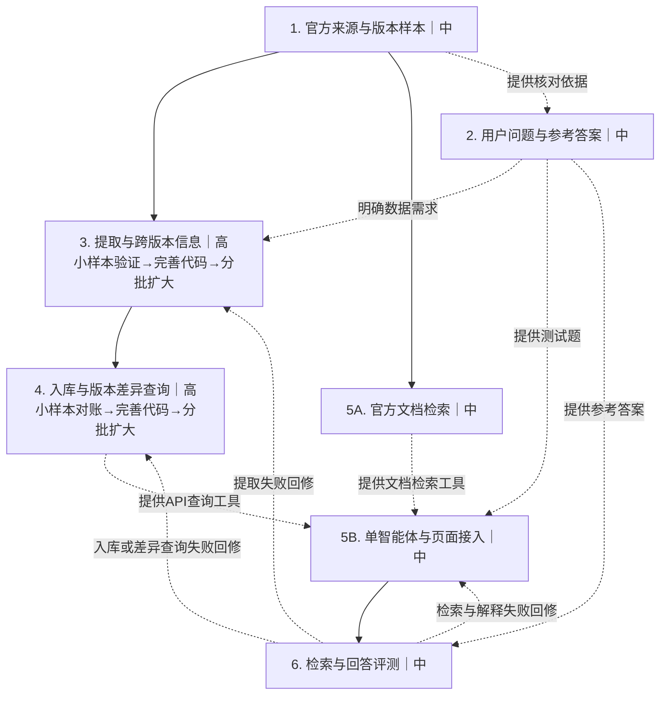

# OpenHarmony API 查询助手总体计划 1.0

修订日期：2026-10-07。状态：计划文档已整理，工程步骤尚未据此执行。

## 目标和边界

面向 OpenHarmony 应用和设备开发者，支持按功能寻找 API、查看指定版本签名与重载、解释参数和使用条件、比较明确版本间的 API 差异，以及获取官方出处。跨版本分析贯穿资料、题集、提取、入库、检索和评测，不作为末尾的独立任务。

基础学习已经开展，不单列任务。需要时按具体任务补学 Hello-Agents 的工具调用、RAG、智能体循环和评估。初始使用 LangChain 单智能体；明确需要受控流程时再直接使用 LangGraph。设备根因诊断、自动改代码和编译运行验证不属于第一版查询交付。

本套文件落实的是计划与技术说明，不表示业务代码、数据库或部署已修改。

## 工作方法

先选择两个来源能够核实的发行版本，以 HTTP 为主场景，音频和通知为补充。步骤 03、04 先拿两个版本中同一小部分声明验证、完善代码，再在这两个步骤内分批增加同版本领域和不同版本样本。初始两版本用于发现数据结构与差异处理问题，不要求一开始全量收集。

每批遵循“取样 → 提取与对账 → 入库与查询对账 → 发现问题并修复 → 回归检查 → 扩大范围”。增加版本时重新核实来源和兼容性；样本通过不等于全量正确。结合自动检查与人工抽查验证推广效果，新增失败案例进入回归检查。提取和入库由 1 人检查；检索和回答由 1—2 人用设计好的问题检验。任务量高不等于必须多人协作。

小样本的工具验收通过后即可支持文档检索和智能体接入，步骤 03、04 的扩大处理可以继续进行，已通过批次进入步骤 05、06。不必等待全部版本处理完，但必须标清每批已验证的范围。

## 关系图

实线表示先后依赖，虚线表示提供数据、工具或题集。同级且无依赖的工作可以并行。

问题收集可以立即开始，参考答案须等待目标版本证据核对。字段约定明确后，入库和查询可先开发，验收使用通过提取检查的数据。文档整理与数据修复可以并行。智能体可用人工核对的固定数据先验证调用流程，完整验收必须接入真实工具。

## 步骤入口和工作量

- [01 官方来源与版本样本](01-官方来源与版本样本.md)：中，建议 1 人。
- [02 用户问题与参考答案](02-用户问题与参考答案.md)：中，建议 1 人整理；评测时由 1—2 人使用。
- [03 提取修复与检查](03-提取修复与检查.md)：高，建议 1 人实施和检查；包括跨版本信息和分批扩展。
- [04 入库与查询工具](04-入库与查询工具.md)：高，可由提取检查的同 1 人连续完成；包括版本对应、差异查询和分批扩展。
- [05 文档检索与智能体](05-文档检索与智能体.md)：中，建议 1—2 人；部署无法复用时可能升为高。
- [06 检索与回答评测](06-检索与回答评测.md)：中，建议 1—2 人。

这是相对工作量判断，不是已测工时，也不指定四人的固定职责。

## 进度

- [x] 总体计划和 6 个步骤说明已修订，扩展与跨版本分析融入各环节。
- [ ] 01 固定官方资料、版本与样本，并核实当前部署代码。
- [ ] 02 完成有依据的题集，分开开发题和验收题。
- [ ] 03 两版本样本提取和回归检查通过，分批扩大并记录结果。
- [ ] 04 样本入库对账、准确查询和版本差异查询通过，分批扩大并记录结果。
- [ ] 05 接通文档检索、单智能体和页面，包括有双端证据的版本比较。
- [ ] 06 单版本、跨版本、追问及异常题评测通过。

## 支持清单是什么

支持清单由各步骤随批次更新，记录平台、发行版本及 API Level、领域、来源提交、是否已收集/已提取/已入库/已检索评测/已回答评测，以及限制和证据位置。版本比较还要记录版本对、对应关系核对及差异查询/回答验收状态。各状态独立，不能由“已入库”推断“回答已支持”。

例如（仅示意）：版本 A 的 HTTP 数据已入库，参数问答已验收，错误码问答尚未验收。实际初始状态应是“待确定版本、未核对、未评测”，不要把示例当成进度。

## 现有任务衔接与证据边界

本计划是 OpenHarmony 场景下的执行说明，不覆盖或取消仓库既有任务，也不另建重复工程任务。进度与验收统一更新到 [workplan](../../workplan.md)：步骤 01 对应 BASE-001、DATA-001；步骤 02 对应 RAG-001、EVAL-001；步骤 03 对应 DATA-001、DATA-002；步骤 04 对应 SAFE-001、DATA-002；步骤 05 对应 RAG-001、REC-001、WEB-001；步骤 06 对应 EVAL-001。相关环境工作仍按 ENV-001、ENV-002 执行。

步骤中的复选框是实施检查清单；正式完成状态、验证证据与验收确认仍记录在 workplan.md，不维护两套相互矛盾的进度。遵守 [协作规范](../../CONTRIBUTING.md)、[AI 规则](../../AGENTS.md)及[数据规范](../data-contract.md)。

历史核查指出声明遗漏、类型误判、可选性与版本注释问题、归属丢失、重载覆盖、字段未入库和无结果随机展示。这些是针对样本复核的起点，不代表当前部署仍全部存在。当前部署与仓库可能不同，先取得实际代码。来源、JSON、入库图谱与线上结果必须分别核实；本轮未重新检查业务代码或数据库。

用户已于 2026-10-07 确认修订内容并授权通过任务分支和 PR 发布合并。文档发布不表示六个工程步骤已经执行或运行验证通过。
